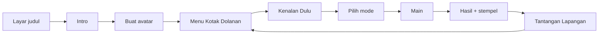

# Kotak Dolanan — Brief Web Permainan Tradisional

Kokurikuler SMP · SNT · Sep 24, 2026 · @Rumah Digicraft

## Ringkasan konsep

Kotak Dolanan adalah web game berisi 9 permainan tradisional. Pemain masuk lewat intro bercerita tentang Pak Guru dan siswa SNT, lalu memilih game dari menu kartu. Webnya bisa dibuka di HP, tablet, laptop, dan Papan Interaktif Digital (PID) kelas.

- **Cerita:** Pak Guru membawa kotak kayu tua berisi benda permainan zaman dulu. Benda-benda itu mulai pudar karena terlupa, dan siswa ditugasi menghidupkannya lagi.
- **Aturan visual:** masa kini tampil berwarna, masa lalu tampil sebagai siluet wayang di atas kelir. Karakter berwarna cukup sedikit, sementara kilas balik tetap terasa sinematik.
- **Misi pemain:** setiap kartu game mulai berwarna abu-abu dan kembali berwarna setelah dimainkan. Tujuan akhirnya adalah mengembalikan warna ke semua isi kotak.
- **Posisi web:** web ini jadi pintu masuk, bukan pengganti. Setiap game ditutup dengan Tantangan Lapangan supaya siswa memainkan versi aslinya di lapangan sekolah.
- **Audiens:** siswa SMP (12–15 tahun). Desainnya harus terasa seperti game beneran, ramah, tapi tidak kekanak-kanakan.

## Naskah intro

Intro berdurasi sekitar 75 detik dalam 7 adegan. Tombol **Lewati** muncul sejak detik pertama, dan setelah kunjungan pertama intro bisa diputar ulang dari menu. Nama siswa di bawah masih sementara dan bisa dipilih lewat voting kelas.

| # | Adegan | Durasi | Visual & animasi | Dialog / narasi |
| --- | --- | --- | --- | --- |
| 0 | Layar judul | tap | Logo Kotak Dolanan di atas pola kain, kotak kayu bergoyang pelan. Tombol besar **Mulai** (sekaligus mengaktifkan suara). | — |
| 1 | Jam istirahat | 10 dtk | Kelas SNT berwarna, bel berbunyi. Bima menguap, Sekar menatap HP yang lowbat, Dimas duduk sendiri di pojok. | Bima: "Istirahat kok gini-gini aja, ya." Sekar: "Yah, lowbat…" |
| 2 | Pak Guru datang | 12 dtk | Pintu terbuka, Pak Guru masuk membawa kotak kayu. Egrang di punggungnya tersangkut di kusen pintu (momen lucu). | Pak Guru: "Dulu waktu Bapak seumuran kalian, jam istirahat nggak pernah sepi." |
| 3 | Kotak dibuka | 10 dtk | Tutup kotak terbuka, cahaya keemasan keluar. Benda melayang satu per satu: bidak, gacuk, dadu, kapur, bola bekel, bakiak, kelereng, balon. | Sekar: "Ini semua apa, Pak?" |
| 4 | Kilas balik wayang | 20 dtk | PID kelas menyala, kamera masuk ke layar. Muncul kelir dengan lampu blencong, siluet anak-anak zaman dulu bermain gobak sodor, engklek, dan egrang bergantian. | Pak Guru: "Dulu lapangan adalah taman bermain kami. Dari permainan ini kami belajar sportif, kompak, dan sabar." |
| 5 | Warna memudar | 10 dtk | Kembali ke kelas. Benda-benda berkedip lalu perlahan berubah abu-abu. | Pak Guru: "Tapi lihat. Kalau tidak ada yang memainkannya lagi, permainan ini bisa hilang." |
| 6 | Misi | 10 dtk | Dimas berdiri pelan, yang lain menoleh. Pak Guru tersenyum, kamera zoom ke kotak, transisi ke layar buat avatar. | Dimas: "Kalau begitu… kita mainkan lagi?" Pak Guru: "Itu proyek kokurikuler kita. Siapa mau ikut?" |

Arahan animasi:

- Dialog tampil sebagai subtitle dalam balon kata, selalu aktif. Suara narasi bersifat opsional dan bisa direkam oleh guru atau siswa sendiri.
- Setiap adegan maju otomatis, tapi pemain bisa tap untuk mempercepat.
- Transisi antar adegan memakai efek kain tersingkap atau gunungan berputar, masing-masing sekitar 0,6 detik.
- Pada adegan 4, siluet digerakkan seperti wayang: bergeser, berayun, dan bayangannya sedikit bergoyang mengikuti nyala lampu.
- Jika perangkat mengaktifkan *reduce motion*, adegan tampil sebagai gambar diam dengan fade sederhana.

## Peta mekanik 9 permainan

Setiap permainan diterjemahkan ke satu mekanik inti yang bisa dilakukan di layar, tanpa melanggar aturan aslinya. Semua game dimainkan secara lokal, tanpa mode online.

Ada tiga mode pemain yang dipakai di seluruh game:

- **Lawan Komputer:** main sendiri melawan pemain atau tim komputer.
- **Main Bergantian:** satu perangkat dipakai bergiliran (*pass & play*), cocok untuk HP.
- **Duel Satu Layar:** layar dibagi dua dan dimainkan bersamaan, paling cocok untuk PID, tablet, dan laptop.

| # | Permainan | Kategori | Cara main di web | Kontrol | Mode | Kesulitan dibuat |
| --- | --- | --- | --- | --- | --- | --- |
| 1 | Dam-daman | Adu Strategi | Papan bergaris diagonal (varian papan 5×5 sebagai dasar). Tap bidak, langkah yang sah menyala, lalu tap tujuan. Lompatan beruntun untuk menangkap. Menang jika bidak lawan habis atau tidak bisa bergerak. | Tap | Komputer, Bergantian | Sulit (logika aturan + AI) |
| 2 | Sundamanda (engklek) | Adu Ketangkasan | Fase 1: lempar gacuk dengan meter kekuatan yang berayun, tap untuk berhenti. Fase 2: lompat dengan tap tepat waktu; kotak berpasangan butuh tap dua tombol bersamaan. Kotak bergacuk dilewati. Salah waktu berarti menginjak garis, giliran pindah. Saat kembali, tahan tombol untuk mengambil gacuk sambil menjaga meter keseimbangan. | Tap berirama | Komputer, Bergantian (2–4) | Sedang |
| 3 | Ular tangga | Adu Strategi | Papan 10×10 bermotif nusantara. Tap dadu, pion berjalan otomatis. Setiap tangga membuka fakta singkat tentang permainan lain di kotak. | Tap | Komputer, Bergantian (2–4) | Mudah (**game pilot**) |
| 4 | Gobak sodor | Adu Kekompakan | Lapangan tampak atas dengan garis jaga. Pemain mengendalikan satu penyerang untuk melewati semua garis lalu kembali. Penjaga komputer hanya bisa bergerak di garisnya. Tersentuh berarti gugur. Setelah satu ronde, peran bertukar dan pemain mengendalikan penjaga. | Joystick virtual / tombol panah | Komputer, Duel Satu Layar | Sulit (AI kejar) |
| 5 | Bola bekel | Adu Ketangkasan | Swipe ke atas untuk melempar bola. Selama bola di udara (ditandai lingkaran menyusut), tap biji bekel sesuai tahap. Tap zona tangkap saat bola turun. Tahap naik dari ambil 1 biji sampai membalik biji ke sisi tertentu. Gagal berarti giliran pindah. | Swipe + tap | Komputer, Bergantian | Sedang |
| 6 | Bakiak | Adu Kekompakan | Game ritme. Tim melangkah saat tombol kiri dan kanan ditekan bergantian sesuai aba-aba. Salah irama membuat meter goyang naik; jika penuh, tim jatuh dan harus menyelesaikan tantangan singkat untuk bangkit. | Tap kiri-kanan | Komputer, Duel Satu Layar | Mudah–sedang |
| 7 | Egrang | Adu Ketangkasan | Tampak samping, balapan 4 jalur (memenuhi minimal 4 pemain). Angkat egrang kiri dan kanan bergantian sambil menjaga badan tetap tegak. Rintangan: tanah bergelombang dan genangan. Tidak ada aksi mendorong. | Tap kiri-kanan, opsional miring HP | Komputer (3 lawan), Duel Satu Layar | Sedang |
| 8 | Kelereng | Adu Ketangkasan | Tampak atas di tanah. Tarik ke belakang untuk membidik (garis bidik + kekuatan), lepas untuk menyentil. Dua mode: **Lubang** (pemain bebas menaruh lubang di awal, sesuai aturan) dan **Tembak** (kenai kelereng lawan). Poin terbanyak menang. | Tarik-lepas | Komputer, Bergantian | Sedang (fisika) |
| 9 | Pecah balon air (opsional, jadi Bonus) | Adu Kekompakan | Estafet membawa balon ke tujuan. Balon punya meter tekanan; gerakan terlalu cepat atau tiba-tiba membuatnya pecah dan pemain mengambil balon baru. Setiap ronde punya cara membawa yang berbeda, misalnya dua tangan atau di atas kepala. Tim tercepat menang. | Seret | Komputer (lawan waktu), Duel Satu Layar | Sedang |

Memenuhi jumlah pemain aslinya: game tim (gobak sodor, bakiak, egrang, balon) memakai anggota tim komputer, sehingga satu siswa tetap bisa bermain. Di PID, Duel Satu Layar untuk bakiak bisa dimainkan 3 siswa per sisi, masing-masing memegang satu tombol kaki, sehingga kekompakan benar-benar dilatih.

## Menu & alur pengguna

Pemain melewati intro sekali, membuat avatar, lalu kembali ke menu Kotak Dolanan setiap kali selesai bermain.



Kunjungan berikutnya langsung dibuka di menu. Avatar dan stempel disimpan di perangkat.

**Menu Kotak Dolanan**

- Setiap game tampil sebagai kartu bergambar **bendanya**: papan dan bidak, gacuk, dadu, kapur tulis, bola bekel, bakiak, egrang, kelereng, dan balon air.
- Isi kartu: nama permainan, kategori, jumlah pemain asli, tingkat kesulitan (1–3 bintang), dan tombol **Main**.
- Kartu abu-abu jika belum dimainkan dan berwarna penuh setelah dimainkan. Pak Guru memberi ucapan saat semua 9 kartu berwarna.
- Filter kategori: **Adu Strategi** (dam-daman, ular tangga), **Adu Ketangkasan** (engklek, bola bekel, egrang, kelereng), dan **Adu Kekompakan** (gobak sodor, bakiak, balon air).
- Game Bonus (pecah balon air) ditandai pita khusus.

**Kenalan Dulu (sebelum bermain)**

- Pak Guru muncul dengan balon kata. Kolom kiri berisi aturan asli dari daftar kokurikuler, kolom kanan berisi cara main di web beserta animasi kontrol.
- Ada info asal daerah dan nama lain permainan dari hasil riset siswa (lihat bagian terakhir).

**Hasil & stempel**

- Layar hasil menampilkan pemenang, stempel bergaya cap batik, dan komentar salah satu dari 3 tokoh siswa.
- Kartu **Tantangan Lapangan** berisi ajakan memainkan versi aslinya bersama teman. Guru dapat mencentang kartu itu untuk memberi stempel emas.

## Karakter & gaya visual

Semua karakter dibuat dari satu **character kit SVG** bergaya flat geometris, sehingga konsisten dan bisa dianimasikan per bagian tanpa keterampilan menggambar.

**Tokoh**

| Tokoh | Peran | Sifat | Ciri visual |
| --- | --- | --- | --- |
| Pak Guru | Narator dan pemandu di Kenalan Dulu | Hangat, suka bercerita, sedikit jenaka | Kemeja batik, kacamata, membawa kotak kayu |
| Bima | Siswa, komentator di layar hasil | Kompetitif, semangat | Rambut jabrik, lengan baju digulung |
| Sekar | Siswa, bertanya di intro | Penasaran, suka bertanya | Kerudung, membawa buku catatan |
| Dimas | Siswa, pencetus misi | Pemalu tapi berani di saat penting | Rambut belah samping, kacamata bundar |
| Avatar pemain | Siswa baru | Dipilih pemain | Rambut, kerudung/peci, warna kulit, aksesori |

Seragam memakai warna SMP putih-biru sebagai bawaan. Ganti dengan seragam dan logo SNT setelah warnanya dipastikan.

**Isi character kit**

- Proporsi kepala dan badan sekitar 1:3,5, cukup ramah tapi tidak terlalu imut untuk anak SMP.
- Bagian terpisah sebagai `<g>` SVG ber-id dengan titik putar (pivot) yang jelas: kepala, rambut, alis, mata, mulut, badan, lengan atas, lengan bawah, tangan, kaki, sepatu.
- Variasi mata: terbuka, tertutup, senang, kaget. Variasi mulut: senyum, bicara A, bicara O, datar.
- Animasi bawaan: berkedip, bernapas (naik-turun pelan), melambai, berbicara, melompat senang.
- Versi siluet untuk kilas balik: kit yang sama dengan isi warna gelap solid di atas kelir bercahaya.

**Palet warna**

| Nama | Hex | Pemakaian |
| --- | --- | --- |
| Kunyit | #E8A33D | Tombol utama, sorotan |
| Merah bata | #B5462F | Aksen, tanda bahaya dalam game |
| Daun pisang | #6E9F3D | Status berhasil, lapangan |
| Biru nila | #2E4C7A | Teks judul, seragam |
| Kertas krem | #F6EBD6 | Latar utama |
| Kayu | #6B4226 | Kotak dolanan, bingkai kartu |
| Cahaya kelir | #FFD58A | Adegan wayang, efek cahaya |

**Tipografi & ornamen**

- Judul memakai **Baloo 2** (bulat, ramah), teks isi memakai **Nunito**. Ukuran teks minimal 16px di HP.
- Ornamen dari motif kain nusantara sebagai bingkai dan latar, dengan aksen motif tapis Lampung.
- Tekstur kertas dan kayu tipis supaya tidak terasa terlalu digital.
- Efek suara pendek bernuansa gamelan dan angklung dari sumber bebas lisensi.

## Responsif & multi-device

Menu memakai layout responsif biasa, sedangkan intro dan game dijalankan di panggung berukuran tetap 1280×720 yang diskalakan otomatis agar pas di semua layar.

| Perangkat | Menu | Intro & game | Kontrol |
| --- | --- | --- | --- |
| HP (tegak) | 1 kolom kartu | Ajakan "putar HP-mu" untuk game yang butuh layar lebar; intro tampil letterbox | Sentuh |
| HP (mendatar) | 2 kolom | Panggung penuh | Sentuh |
| Tablet | 2–3 kolom | Panggung penuh, Duel Satu Layar tersedia | Sentuh, multi-touch |
| Laptop | 3–4 kolom | Panggung penuh | Mouse + keyboard (panah, spasi, A/L untuk duel) |
| PID kelas | 4 kolom, kartu lebih besar | Duel Satu Layar jadi mode utama | Multi-touch untuk beberapa siswa sekaligus |

Aturan wajib:

- Pakai **Pointer Events** agar sentuhan dan mouse ditangani oleh satu kode. Duel Satu Layar membaca beberapa titik sentuh sekaligus.
- Area tap minimal 48×48px, dan tidak ada fungsi yang hanya muncul saat hover.
- Latar di luar panggung (area letterbox) diisi pola kain, bukan warna hitam.
- Target performa: tetap 60 fps di HP Android kelas bawah. Animasi memakai transform SVG/CSS, tanpa video berat, dan setiap game baru dimuat saat dipilih.
- Dijadikan **PWA** supaya bisa dipasang di layar utama dan dimainkan saat WiFi sekolah putus.
- Suara baru aktif setelah tap pertama (syarat browser iPhone), dipicu oleh tombol Mulai. Ada tombol matikan suara di setiap layar.
- Mode *reduce motion* dihormati: intro disederhanakan dan efek goyang layar dimatikan.

## Arsitektur teknis & urutan pengerjaan

Struktur webnya satu aplikasi React. Setiap game adalah modul terpisah dengan antarmuka yang sama, sehingga game baru tinggal dipasang tanpa mengubah menu.

| Bagian | Pilihan | Alasan |
| --- | --- | --- |
| Kerangka | Vite + React + TypeScript | Cepat, ringan, cocok untuk dikerjakan bersama Claude Code |
| Animasi intro & UI | GSAP | Timeline adegan mudah diatur dan performanya baik di HP |
| Game papan (dam-daman, ular tangga) | React + SVG | Berbasis giliran, tidak butuh game engine |
| Game aksi (7 lainnya) | Phaser 3 | Fisika, input multi-touch, dan skala panggung sudah tersedia |
| State & simpanan | Zustand + localStorage | Avatar, stempel, dan pengaturan tersimpan per perangkat |
| Suara | Howler.js | Menangani aturan buka-kunci audio di iPhone |
| Offline | vite-plugin-pwa | Bisa dipasang dan dimainkan tanpa internet |
| Hosting | Vercel | Gratis dan deploy otomatis dari GitHub |

Struktur folder:

```
src/
  app/          # routing, layout, penskalaan panggung
  intro/        # adegan intro (GSAP timeline) + naskah JSON
  menu/         # kartu game, filter, stempel
  characters/   # character kit SVG + animasi
  games/
    ular-tangga/
    dam-daman/
    ...         # satu folder per game
  shared/       # GameShell, HUD, layar hasil, pemilih mode
  data/games.json  # nama, kategori, aturan asli, cara main web
```

Setiap game mengekspor antarmuka yang sama:

```ts
export interface GameModule {
  id: string;
  modes: ('cpu' | 'hotseat' | 'split')[];
  orientation: 'landscape' | 'any';
  mount(el: HTMLElement, opts: { mode: string; players: Player[] }): void;
  unmount(): void;
  onFinish?: (result: GameResult) => void;
}
```

Pencentangan Tantangan Lapangan oleh guru memakai PIN guru sederhana di perangkat siswa, karena belum ada server.

**Urutan pengerjaan**

| Tahap | Isi | Selesai jika |
| --- | --- | --- |
| 1 | Design system + character kit di Claude Design | Palet, font, kartu, tombol, dan 4 tokoh sudah final |
| 2 | Kerangka app, penskalaan panggung, menu, `games.json` | Menu tampil benar di HP, tablet, laptop, dan PID |
| 3 | Game pilot: ular tangga + GameShell + layar hasil | Satu game bisa dimainkan dari menu sampai stempel |
| 4 | Intro 7 adegan | Intro berjalan mulus dan bisa dilewati |
| 5 | Bakiak (uji Duel Satu Layar dan multi-touch di PID), lalu kelereng (uji fisika) | Dua pola kontrol utama terbukti jalan |
| 6 | Engklek, bola bekel, egrang, gobak sodor, dam-daman, balon air | Semua 9 game jalan |
| 7 | PWA, audio, uji coba bersama siswa | Masukan siswa sudah diperbaiki |

## Prompt Claude Design

Jalankan empat prompt ini berurutan dalam satu proyek Claude Design. Setujui hasil setiap prompt sebelum lanjut ke prompt berikutnya, karena semuanya saling bergantung.

**Prompt 1: design system**

```
Buatkan design system untuk web game edukasi "Kotak Dolanan" berisi 9 permainan tradisional Indonesia, untuk siswa SMP (12–15 tahun). Nuansanya ramah dan hangat seperti game beneran, tidak kekanak-kanakan.

Palet: Kunyit #E8A33D (tombol utama), Merah bata #B5462F (aksen), Daun pisang #6E9F3D (berhasil), Biru nila #2E4C7A (judul), Kertas krem #F6EBD6 (latar), Kayu #6B4226 (bingkai), Cahaya kelir #FFD58A (efek cahaya).
Font: Baloo 2 untuk judul, Nunito untuk isi. Teks minimal 16px.
Ornamen: motif kain nusantara dan aksen tapis Lampung sebagai bingkai, tekstur kertas dan kayu tipis.

Komponen yang dibutuhkan: tombol utama/sekunder/ikon (area tap minimal 48px), kartu game dalam status abu-abu (belum dimainkan) dan berwarna (sudah dimainkan), chip kategori (Adu Strategi, Adu Ketangkasan, Adu Kekompakan), rating bintang 1–3, balon kata dialog, stempel bergaya cap batik, panel modal, HUD skor, dan tombol suara.
```

**Prompt 2: character kit**

```
Pakai design system tadi. Buatkan character kit SVG bergaya flat geometris (bentuk dari lingkaran dan kotak membulat, maksimal 2 tone per warna), proporsi kepala:badan 1:3,5.

Setiap karakter disusun dari bagian terpisah sebagai <g> ber-id dengan titik putar yang jelas: head, hair, brows, eyes, mouth, torso, arm-upper-l/r, arm-lower-l/r, hand-l/r, leg-l/r, shoe-l/r. Variasi mata: open, closed, happy, surprised. Variasi mulut: smile, talk-a, talk-o, flat.

Tokoh:
1. Pak Guru — kemeja batik, kacamata, hangat dan jenaka.
2. Bima — siswa SMP seragam putih-biru, rambut jabrik, lengan digulung, kompetitif.
3. Sekar — siswi SMP berkerudung, membawa buku catatan, penasaran.
4. Dimas — siswa SMP, rambut belah samping, kacamata bundar, pemalu.
5. Template avatar dengan pilihan rambut (5 gaya), kerudung, peci, dan 5 warna kulit.

Sertakan juga versi siluet (isi gelap solid) dari 3 anak berpose sedang bermain gobak sodor, engklek, dan egrang, untuk adegan wayang.
```

**Prompt 3: layar utama**

```
Pakai design system dan character kit tadi. Buat mockup layar berikut, masing-masing dalam 3 ukuran: HP 390×844, tablet 1024×768, dan desktop/PID 1920×1080.

1. Menu Kotak Dolanan: 9 kartu game bergambar bendanya (papan dam-daman, gacuk engklek, dadu ular tangga, kapur gobak sodor, bola bekel, bakiak, egrang, kelereng, balon air). 3 kartu berwarna, sisanya abu-abu. Ada filter kategori, penghitung stempel, dan avatar pemain di pojok.
2. Kenalan Dulu: Pak Guru di kiri dengan balon kata, kolom "Aturan asli" dan "Cara main di web", pilihan mode (Lawan Komputer, Main Bergantian, Duel Satu Layar), tombol Main.
3. Layar hasil: pemenang, stempel cap batik, komentar Bima, dan kartu Tantangan Lapangan.
4. Pembuat avatar.
```

**Prompt 4: storyboard intro**

```
Buat 7 frame storyboard intro ukuran 1280×720 sesuai naskah berikut: [tempel tabel Naskah intro dari dokumen ini]. Adegan masa kini berwarna penuh; adegan kilas balik (adegan 4) tampil sebagai siluet wayang di atas kelir dengan cahaya lampu blencong #FFD58A. Tulis catatan gerak animasi di bawah setiap frame.
```

## Prompt Claude Code

Mulai dengan menaruh aturan proyek di `CLAUDE.md`, lalu kerjakan satu prompt per tahap. Ekspor hasil Claude Design (SVG karakter dan token warna) ke folder `design/` sebelum prompt kedua.

**CLAUDE.md**

```markdown
# Kotak Dolanan
Web game 9 permainan tradisional untuk kokurikuler SMP SNT. Target: HP, tablet, laptop, dan Papan Interaktif Digital (multi-touch).

## Stack
Vite + React + TypeScript, GSAP (intro & UI), Phaser 3 (game aksi), React + SVG (game papan), Zustand + localStorage, Howler.js, vite-plugin-pwa.

## Aturan
- Semua teks UI berbahasa Indonesia, ramah untuk siswa SMP.
- Input selalu lewat Pointer Events; tidak ada fungsi yang bergantung pada hover.
- Area tap minimal 48px. Hormati prefers-reduced-motion.
- Intro dan game berjalan di panggung 1280x720 yang diskalakan; letterbox diisi pola kain.
- Setiap game adalah modul di src/games/<id>/ yang mengikuti interface GameModule di src/shared/types.ts.
- Data permainan (nama, kategori, aturan asli, cara main web) hanya dari src/data/games.json.
- Warna dan font hanya dari design token di src/app/tokens.css.
- Uji setiap layar di 390x844, 1024x768, dan 1920x1080 sebelum menyatakan selesai.
```

**Prompt A: kerangka & menu**

```
Baca CLAUDE.md dan folder design/. Buat kerangka aplikasi: routing (judul, intro, avatar, menu, kenalan, main, hasil), komponen Stage yang menskalakan panggung 1280x720, design token dari design/, dan src/data/games.json berisi 9 permainan dari tabel berikut: [tempel tabel Peta mekanik].

Bangun menu Kotak Dolanan sesuai mockup: kartu abu-abu/berwarna berdasarkan progres di Zustand (persist ke localStorage), filter kategori, penghitung stempel. Grid 1 kolom di HP tegak, 2 di HP mendatar, 3 di tablet, 4 di desktop/PID. Tambahkan GameShell (pemilih mode, HUD, jeda, layar hasil + stempel + Tantangan Lapangan dengan PIN guru) dan interface GameModule.
```

**Prompt B: game pilot ular tangga**

```
Buat game ular tangga di src/games/ular-tangga/ dengan React + SVG mengikuti GameModule. Papan 10x10 bermotif nusantara, 2–4 pemain (mode cpu dan hotseat), dadu dianimasikan, pion berjalan per kotak. Aturan: naik di kaki tangga, turun di kepala ular, pemain pertama yang mencapai kotak 100 menang. Setiap tangga menampilkan fakta singkat tentang salah satu permainan lain dari games.json. Sambungkan ke GameShell sampai stempel tersimpan dan kartu di menu berubah warna.
```

**Prompt C: intro**

```
Buat intro di src/intro/ memakai GSAP timeline dari naskah berikut: [tempel tabel Naskah intro]. Pisahkan naskah ke intro/script.json. Karakter dari characters/ dianimasikan per bagian (berkedip, bernapas, bicara saat dialognya tampil). Adegan 4 memakai siluet di atas kelir dengan cahaya yang bergoyang. Tombol Lewati selalu ada, tap mempercepat adegan, dan intro hanya otomatis diputar pada kunjungan pertama.
```

**Template prompt untuk 8 game lainnya**

```
Buat game [nama] di src/games/[id]/ memakai [Phaser 3 / React + SVG] mengikuti GameModule.
Aturan asli: [tempel dari daftar kokurikuler].
Cara main di web: [tempel dari tabel Peta mekanik].
Kontrol: [sentuh / mouse / keyboard]. Mode: [cpu / hotseat / split]. Orientasi: [landscape / any].
Untuk mode split, baca beberapa pointer sekaligus dan bagi layar kiri-kanan.
Pakai karakter dari characters/ dan token warna. Sambungkan ke GameShell sampai hasil dan stempel.
Setelah selesai, uji di 390x844 mendatar, 1024x768, dan 1920x1080.
```

## Catatan budaya & tugas riset siswa

Daftar kokurikuler belum mencantumkan asal daerah dan nama lain setiap permainan. Isi bagian itu dari riset siswa, bukan dari tebakan, supaya kontennya akurat dan siswa ikut berkontribusi.

**Tugas riset per kelompok (satu permainan per kelompok)**

- [ ] Asal daerah dan nama lain permainan di daerah lain, termasuk nama lokal di Lampung jika ada, lengkap dengan sumbernya
- [ ] Nilai karakter yang dilatih (misalnya sportivitas, kerja sama, kesabaran), ditulis dalam satu kalimat untuk layar Kenalan Dulu
- [ ] Foto atau video saat memainkan versi aslinya di lapangan sekolah, dengan izin sekolah dan orang tua sebelum dipakai di web
- [ ] Rekaman suara untuk dialog tokoh dan narasi intro (opsional)
- [ ] Voting nama akhir tiga tokoh siswa

**Yang perlu dipastikan sebelum dibuat**

- Warna seragam dan logo SNT untuk karakter dan palet.
- Varian papan dam-daman yang dipakai di sekolah: jumlah bidak, bentuk papan, dan apakah menangkap bidak itu wajib.
- Istilah tahap bola bekel yang dipakai siswa, karena namanya berbeda di tiap daerah.
- Pola kotak engklek yang dipakai (jumlah dan bentuk kotak).

**Rambu budaya**

- Setiap tokoh digambarkan dengan sifatnya sendiri, bukan dengan stereotip suku atau daerah.
- Siluet wayang cukup dipakai sebagai gaya visual dan tidak meniru tokoh wayang tertentu.
- Musik dan efek suara diambil dari sumber berlisensi bebas atau direkam sendiri, dan sumbernya dicantumkan di halaman kredit.
